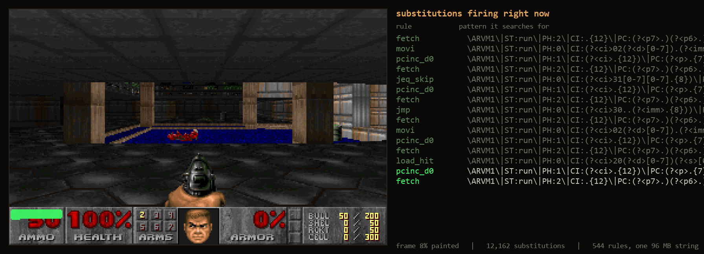

# DOOM en regex

Este es DOOM ejecutándose en una computadora cuya única operación es una búsqueda y reemplazo global mediante regex (expresiones regulares). Toda la máquina reside dentro de una sola cadena larga: los registros, la RAM, el framebuffer, el motor de DOOM y el WAD están todos en esa cadena como texto plano, y un pequeño controlador aplica una lista fija y ordenada de reglas de sustitución una y otra vez. En cada paso, la primera regla que coincida se ejecuta exactamente una vez, y esa única ejecución representa un ciclo (tick) de la máquina. No hay un intérprete ni aritmética en ningún lugar fuera de las reglas, por lo que eliminar el conjunto de reglas deja el archivo de texto inerte.

A continuación, puedes ver a la máquina pintando un fotograma. El color verde marca los píxeles que las sustituciones actuales están escribiendo: las paredes aparecen columna por columna, los suelos se llenan tramo por tramo, y las pausas entre trazos son el recorrido BSP decidiendo qué dibujar a continuación. Cada trazo verde es un regex reemplazando unos pocos caracteres en algún lugar dentro de una cadena de 96.6 MB:

<p align="center">
  
</p>

<br>

<p align="center">
  <a href="https://github.com/4RH1T3CT0R7/doom-regex/releases/latest"></a>
  &nbsp;&nbsp;&nbsp;
  <a href="https://4rh1t3ct0r7.github.io/doom-regex/"></a>
</p>

Un solo fotograma de E1M1 (fotograma 60 del timedemo) requiere **13 994 067 sustituciones** y el resultado es idéntico byte por byte al mismo fotograma renderizado por DOOM compilado nativamente; los hashes SHA-256 coinciden. Un solo fotograma podría ser una casualidad, así que aquí hay cien de ellos: los fotogramas 160 al 259 del timedemo, en los que el jugador recoge la armadura y la escopeta mientras los demonios se acercan. Calcular el clip tomó unos 1.25 mil millones de sustituciones, y cada uno de los cien fotogramas coincide byte por byte con la compilación nativa:

<p align="center">
  
</p>

## Por qué funciona esto

La reescritura iterada de cadenas es Turing-completa, ya que es un algoritmo de Markov, uno de los modelos clásicos de computación. En principio, entonces, un montón de regex siempre iba a ser capaz de ejecutar DOOM; las preguntas que valía la pena responder eran si podría hacerlo antes de la muerte térmica del universo y cómo demostrar que nada en el camino estuviera haciendo trampas silenciosamente.

Las 544 reglas implementan una pequeña CPU de 32 bits llamada RVM-1. Su estado es una cadena que comienza con un encabezado similar a `RVM1|ST:run|PH:0|CI:...|PC:...|R0:...|R7:...|CLK:...|` y continúa con zonas: tablas de búsqueda, RAM plana (`#N`), el programa (`#P`), el framebuffer (`#F`), el WAD (`#W`), memoria alta dispersa (`#M`) y la cola de E/S. La suma ocurre mediante ocho sondeos de mirada hacia adelante (lookahead) en una tabla de sumador completo de 512 entradas, con el acarreo transmitido de sondeo en sondeo a través de grupos de captura, mientras que la multiplicación y la división se ejecutan como secuencias de micro-fases, y el campo `PH` en el encabezado registra cuánto ha avanzado la máquina en una de ellas.

El acceso a la memoria es el mejor truco del conjunto. Una regla salta un número exacto de caracteres hacia la zona de RAM plana, y la longitud de ese salto se ensambla a partir de los dígitos de la dirección mediante grupos de marcadores de bits vacíos y saltos condicionales, lo que equivale a un árbol binario detallado en regex. Nada escanea nunca en busca de una ranura: la regla cae directamente en ella. La búsqueda de instrucciones (instruction fetch) realiza la misma maniobra con el contador de programa para encontrar la ranura de instrucción actual.

DOOM llega a esta CPU a través de [doomgeneric](https://github.com/ozkl/doomgeneric), compilado con [8cc y ELVM](https://github.com/shinh/elvm) siguiendo el camino que [BFDoom](https://github.com/jasperdevs/BFDoom) abrió primero.

Nada de esto se acepta por fe. Un emulador de referencia ejecuta el mismo conjunto de instrucciones en Python, la suite de pruebas requiere que la cadena sea igual al estado del emulador byte por byte después de cada sustitución, y los fotogramas renderizados deben coincidir con el hash de DOOM compilado nativamente.

## Números

| | |
|---|---|
| reglas de reescritura | 544, fijas y con hash SHA-256 antes de iniciar la ejecución |
| estado de la máquina | una sola cadena de 96.6 MB |
| un fotograma de E1M1 | 13 994 067 sustituciones |
| el clip de 100 fotogramas | unos 1.25 mil millones de sustituciones |
| velocidad | alrededor de 80 000 sustituciones por segundo por núcleo (PCRE2 con JIT, medido durante la ejecución del clip) |
| primera versión funcional | 7 sustituciones por segundo; a ese ritmo, solo las últimas 295 000 sustituciones del fotograma tardaron 12 horas |

Los cuatro órdenes de magnitud entre las dos últimas filas son una historia aparte. La búsqueda mediante árbol de dígitos reemplazó el escaneo lineal de la zona del programa, los saltos `dotall` permitieron que el JIT avanzara un puntero en lugar de buscar saltos de línea, una zona de memoria plana retiró el antiguo escaneo de celdas dispersas, y un empalme de salto de identidad (`identity-skip splice`) significa que el largo prefijo que una sustitución mantiene textualmente nunca se copia en absoluto. Con todo esto implementado, las ejecuciones de producción distribuyeron el trabajo en cinco máquinas en paralelo, y un fotograma se obtiene en aproximadamente tres minutos.

## Pruébalo

**[Descarga la demo](https://github.com/4RH1T3CT0R7/doom-regex/releases/latest)**, descomprímela y haz doble clic en `doomregex_demo.exe` (Windows). Lanza la máquina real con el conjunto de reglas real y muestra el fotograma siendo renderizado en vivo, junto a un flujo de sustituciones que te indica qué regla se ejecutó, qué consumió y qué escribió. La demo es genuinamente jugable: WASD o las teclas de dirección para moverte, Ctrl para disparar, Espacio para abrir puertas, y cada pulsación de tecla cae en `input.bin`, donde la máquina la recoge con su instrucción GETC. Dado que un fotograma tarda unos minutos en computarse, la experiencia se asemeja más al ajedrez por correspondencia con una escopeta que a un shooter frenético.

O constrúyelo todo tú mismo:

```
# rules
py -3.11 vm/genpattern.py
# driver (gcc + static PCRE2, LINK_SIZE=4)
bash scripts/build_driver.sh
# run the machine
rvm.exe --rules vm/rules_rvm.rgxset --state snapshot.rvstate
```

La suite de pruebas (`py -3.11 -m pytest tests/`) ejecuta el diff sincronizado contra el emulador de referencia, las pruebas de concordancia del controlador (el controlador en C y un prototipo en Python deben producir bytes idénticos) y las verificaciones doradas.

## Antecedentes y novedades

- El [Regex Chess](https://nicholas.carlini.com/writing/2025/regex-chess.html) de Nicholas Carlini juega al ajedrez en 84 688 sustituciones, aunque las ejecuta como una secuencia lineal fija y deliberadamente no es Turing-completo. Este proyecto explora la rama que él dejó deliberadamente de lado: un conjunto de reglas fijas aplicadas cíclicamente, que es lo que convierte a la máquina en un modelo de computación genuino.
- [BFDoom](https://github.com/jasperdevs/BFDoom) ejecuta DOOM compilado a Brainfuck, sin regex involucrados en ninguna parte, y tomamos prestados agradecidamente sus parches de la cadena de herramientas ELVM.
- Se ha logrado que `sed` ejecute Tetris y Sokoban, y la comunidad de lenguajes esotéricos demostró que el reemplazo iterado de regex era Turing-completo hace años.

Hasta donde sabemos, nadie había ejecutado DOOM, ni cualquier otro juego, ni ningún video en absoluto, en un bucle de sustitución de regex iterado anteriormente. Si conoces antecedentes que hayamos pasado por alto, por favor abre un issue.

## Mapa del repositorio

```
vm/          ISA, ensamblador, emulador de referencia, generador de reglas, códec de estado
driver/      el controlador en C: PCRE2, un bucle, el contrato de "solo reglas" en comentarios
doom/        puerto doomgeneric, parches de herramientas ELVM, scripts de construcción
tests/       suite sincronizada, concordancia del controlador, goldens
scripts/     creación de snapshots, benchmarks, constructores de clips/timelapses
demo/        el visor descargable (Win32/GDI)
docs/        el sitio interactivo (GitHub Pages)
```

## Licencia

GPL-2.0, heredada del propio código fuente de DOOM: el repositorio contiene un puerto de DOOM a través de doomgeneric, y todo lo que derive de código GPL lleva la licencia consigo. La única excepción es `doom1.wad`, que son los datos shareware originales de id Software y no están cubiertos por la GPL.
