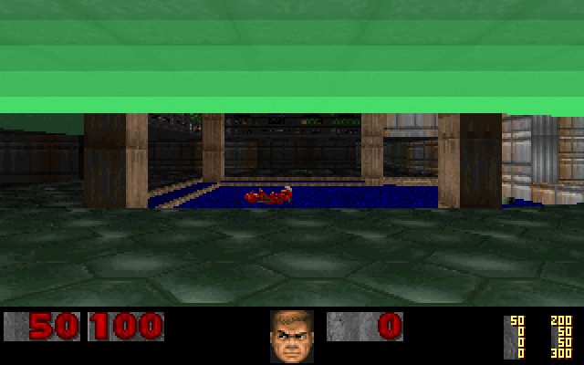
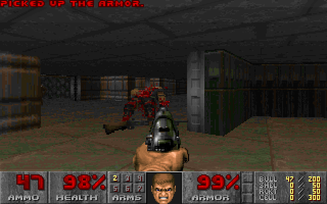

# DOOM on regex

This is DOOM running on a computer whose only operation is a global regex find-and-replace. The whole machine lives inside one long string: the registers, the RAM, the framebuffer, the DOOM engine and the WAD all sit in that string as plain text, and a small driver applies a fixed, ordered list of substitution rules to it over and over. On every step the first rule that matches fires exactly once, and that single firing is one tick of the machine. There is no interpreter and no arithmetic anywhere outside the rules, so deleting the ruleset leaves you with an inert text file.

Below you can watch the machine paint a frame. Green marks the pixels the current substitutions are writing: walls appear column by column, floors fill span by span, and the pauses between strokes are the BSP traversal deciding what to draw next. Each green stroke is one regex replacing a few characters somewhere inside a 96.6 MB string:

<p align="center">
  
</p>

<br>

<p align="center">
  <a href="https://github.com/4RH1T3CT0R7/doom-regex/releases/latest"></a>
  &nbsp;&nbsp;&nbsp;
  <a href="https://4rh1t3ct0r7.github.io/doom-regex/"></a>
</p>

A single frame of E1M1 (frame 60 of the timedemo) takes **13 994 067 substitutions** and comes out byte-identical to the same frame rendered by natively compiled DOOM; the SHA-256 hashes match. One frame could always be a fluke, so here are a hundred of them: frames 160 through 259 of the timedemo, in which the player grabs the armor and the shotgun while demons close in. Computing the clip took about 1.25 billion substitutions, and every one of the hundred frames matches the native build byte for byte:

<p align="center">
  
</p>

## Why this works at all

Iterated string rewriting is Turing-complete, because it is a Markov algorithm, one of the classic models of computation. In principle, then, a pile of regexes was always going to be able to run DOOM; the questions worth answering were whether it could do so before the heat death of the universe, and how to prove that nothing along the way was quietly cheating.

The 544 rules implement a small 32-bit CPU called RVM-1. Its state is a string that opens with a header along the lines of `RVM1|ST:run|PH:0|CI:...|PC:...|R0:...|R7:...|CLK:...|` and continues with zones: lookup tables, flat RAM (`#N`), the program (`#P`), the framebuffer (`#F`), the WAD (`#W`), sparse high memory (`#M`), and the I/O tail. Addition happens as eight lookahead probes into a 512-entry full-adder table, with the carry threaded from probe to probe through capture groups, while multiplication and division run as sequences of micro-phases, and the `PH` field in the header records how far along one the machine is.

Memory access is the best trick in the set. A rule jumps an exact number of characters into the flat RAM zone, and the length of that jump is assembled from the digits of the address by empty bit-marker groups and conditional jumps, which amounts to a binary tree spelled out in regex. Nothing ever scans for a slot: the rule lands on it directly. Instruction fetch pulls the same stunt with the program counter to find the current instruction slot.

DOOM itself reaches this CPU through [doomgeneric](https://github.com/ozkl/doomgeneric), compiled with [8cc and ELVM](https://github.com/shinh/elvm) along the trail that [BFDoom](https://github.com/jasperdevs/BFDoom) blazed first.

None of it is taken on faith. A reference emulator runs the same instruction set in Python, the test suite requires the string to equal the emulator's state byte for byte after every single substitution, and the rendered frames have to match natively compiled DOOM hash for hash.

## Numbers

| | |
|---|---|
| rewrite rules | 544 of them, fixed and SHA-256-hashed before the run starts |
| machine state | a single string of 96.6 MB |
| one frame of E1M1 | 13 994 067 substitutions |
| the 100-frame clip | about 1.25 billion substitutions |
| speed | around 80 000 substitutions per second per core (PCRE2 with JIT, measured over the clip run) |
| first working build | 7 substitutions per second; at that pace the last 295 000 substitutions of the frame alone took 12 hours |

The four orders of magnitude between the last two rows are a story of their own. The digit-tree fetch replaced a linear scan of the program zone, dotall jumps let the JIT advance a pointer rather than hunt for newlines, a flat memory zone retired the old sparse cell scan, and an identity-skip splice means that the long prefix a substitution keeps verbatim is never copied at all. With all of that in place the production runs spread the work across five machines in parallel, and a frame comes out in roughly three minutes.

## Try it

**[Download the demo](https://github.com/4RH1T3CT0R7/doom-regex/releases/latest)**, unzip it, and double-click `doomregex_demo.exe` (Windows). It launches the real machine on the real ruleset and shows the frame being rendered live, next to a substitution feed that tells you which rule fired, what it consumed, and what it wrote. The demo is genuinely playable, too: WASD or the arrow keys move, Ctrl fires, Space opens doors, and every keypress lands in `input.bin`, where the machine picks it up with its GETC instruction. Since a frame takes a few minutes to compute, the experience is closer to correspondence chess with a shotgun than to a twitch shooter.

Or build everything yourself:

```
# rules
py -3.11 vm/genpattern.py
# driver (gcc + static PCRE2, LINK_SIZE=4)
bash scripts/build_driver.sh
# run the machine
rvm.exe --rules vm/rules_rvm.rgxset --state snapshot.rvstate
```

The test suite (`py -3.11 -m pytest tests/`) runs the lockstep diff against the reference emulator, the driver agreement tests (the C driver and a Python prototype must produce identical bytes), and the golden checks.

## Prior art, and what's new here

- Nicholas Carlini's [Regex Chess](https://nicholas.carlini.com/writing/2025/regex-chess.html) plays chess in 84 688 substitutions, though it runs them as a fixed straight-line sequence and is deliberately not Turing-complete. This project explores the branch he deliberately left alone: a fixed ruleset applied cyclically, which is what makes the machine a genuine model of computation.
- [BFDoom](https://github.com/jasperdevs/BFDoom) runs DOOM compiled to Brainfuck, with no regex involved anywhere, and we gratefully borrowed its ELVM toolchain patches.
- sed has been coaxed into Tetris and Sokoban, and the esolang community proved iterated regex replacement Turing-complete years ago.

As far as we can tell, nobody had run DOOM, or any other game, or any video at all, on an iterated regex substitution loop before. If you know of prior art we missed, please open an issue.

## Repository map

```
vm/          ISA, assembler, reference emulator, rule generator, state codec
driver/      the C driver: PCRE2, one loop, the rules-only contract in comments
doom/        doomgeneric port, ELVM toolchain patches, build scripts
tests/       lockstep suite, driver agreement, goldens
scripts/     snapshot baking, benchmarks, clip/timelapse builders
demo/        the downloadable viewer (Win32/GDI)
docs/        the interactive site (GitHub Pages)
```

## License

GPL-2.0, inherited from the DOOM source itself: the repository contains a port of DOOM via doomgeneric, and everything downstream of GPL code carries the license with it. The one exception is doom1.wad, which is the original id Software shareware data and is not covered by the GPL.
